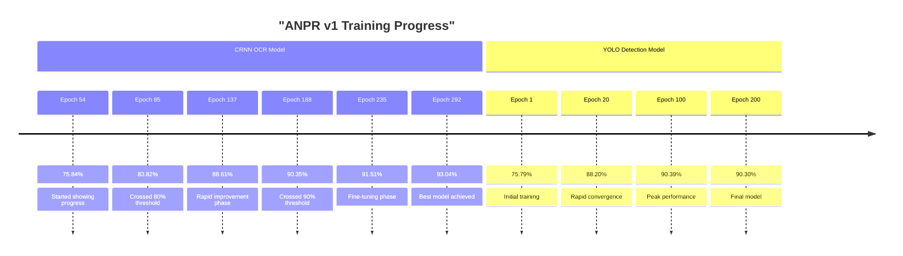

# ANPR (Automatic Number Plate Recognition) System v1.0

A comprehensive solution for detecting and recognizing license plates from images and video streams using state-of-the-art deep learning models.

> **Version 1.0** - Includes optimized YOLO11n-ANPR detection and enhanced multi-line CRNN OCR models

## 🚀 Features

- **Real-time Detection**: Live camera feed processing with PyQt5 GUI
- **Video Processing**: Batch processing of video files
- **Dual Model Architecture**:
  - YOLO11 for vehicle and license plate detection
  - CRNN for Optical Character Recognition (OCR)
- **Multi-format Support**: Various image and video formats
- **Parking Detection**: Identify parked vehicles
- **Zone-based Detection**: Define custom detection zones
- **Duplicate Prevention**: Smart filtering to avoid repeated detections
- **Comprehensive Logging**: Detailed logs and result visualization

## 📁 Project Structure

```
ANPR/
├── README.md                 # This file
├── requirements.txt          # Python dependencies
├── setup.py                 # Installation script
├── src/                     # Source code
│   ├── __init__.py
│   ├── main.py              # Main application (GUI)
│   ├── models/              # Model definitions
│   ├── utils/               # Utility functions and config
│   │   ├── config.py        # Centralized configuration
│   │   └── data_utils.py    # Data processing utilities
│   └── training/            # Training scripts
│       ├── train_detection.py # YOLO training
│       ├── train_ocr.py     # CRNN training
│       └── data_processing.py # Data preprocessing
├── config/                  # Configuration files
│   ├── deployment_config.json
│   ├── data.yaml           # YOLO data configuration
│   └── training_config.yaml
├── data/                    # Data directories
│   ├── raw/                # Raw input data
│   ├── processed/          # Processed data
│   └── annotations/        # Training annotations
├── models/                  # Trained models
│   ├── detection/          # YOLO models
│   │   └── yolo11/
│   └── ocr/               # CRNN models
│       └── crnn/
├── outputs/                # Output results
│   ├── detected_plates/    # Detected plate images
│   ├── logs/              # Log files
│   └── results/           # Analysis results
└── scripts/               # Utility scripts
    ├── evaluate.py        # Model evaluation
    └── demo.py           # Demo scripts
```

## 🛠️ Installation

### Prerequisites

- Python 3.8 or higher
- CUDA-capable GPU (recommended for training)
- Webcam or video files for testing

### Option 1: Quick Setup

```bash
# Clone the repository
git clone <repository-url>
cd ANPR

# Install dependencies
pip install -r requirements.txt

# Create directory structure
python src/utils/config.py
```

### Option 2: Development Setup

```bash
# Clone the repository
git clone <repository-url>
cd ANPR

# Install in development mode
pip install -e .

# Install development dependencies
pip install -e .[dev]

# Install fast CTC decoding (optional, for better OCR performance)
pip install -e .[fast]
```

## 🚦 Quick Start

### 1. Model Setup

The system includes pre-trained models optimized for ANPR:

**YOLO Detection Models:**

- Primary: `models/detection/yolo11n_anpr/weights/best.pt`
- Alternative: `models/detection/yolo11n_anpr_small_batch/weights/best.pt`

**CRNN OCR Models (v1):**

- Primary: `models/ocr/crnn_v1/best_multiline_crnn_epoch292_acc0.9304.pth` (93.04% accuracy)
- Alternative: `models/ocr/crnn_v1/checkpoint_epoch_310_acc0.923.pth` (92.3% accuracy)
- Character set: `data/processed/all_chars.txt`

**Model Selection:**
The system automatically selects the best available model from each category.

### 2. Run the Application

```bash
# Method 1: Direct execution
python src/main.py

# Method 2: Using setup.py entry point (after installation)
anpr

# Method 3: Module execution
python -m src.main
```

### 3. Using the GUI

1. **Select Input Source**: Choose between camera or video file
2. **Configure Settings**: Adjust confidence thresholds and detection parameters
3. **Start Detection**: Click "Start" to begin processing
4. **View Results**: Detected plates will appear in the results panel

## 🏋️ Training

### Training Detection Model (YOLO)

```bash
# Prepare your dataset in YOLO format
# Update data.yaml with your dataset paths

# Train the model
python src/training/train_detection.py

# Or using entry point
anpr-train-detection
```

#### Training Configuration:

- **Base Model**: YOLO11n (nano)
- **Epochs**: 200
- **Batch Size**: 32 (fallback to 8 for limited VRAM)
- **Image Size**: 416x416
- **Optimizer**: Auto (AdamW)
- **Learning Rate**: 0.008 (initial), 0.01 (final)
- **Augmentation**: HSV, translate, scale, flip, mosaic, mixup
- **Loss Weights**: Box=7.5, Class=0.87, DFL=1.5

### Training OCR Model (CRNN)

```bash
# Prepare your OCR dataset
python src/training/data_processing.py

# Train the model
python src/training/train_ocr.py

# Or using entry point
anpr-train-ocr
```

#### Training Configuration:

- **Architecture**: Enhanced Multi-Line CRNN with Attention
- **Input Size**: 256x64 pixels (grayscale)
- **Hidden Size**: 256
- **Epochs**: 500 (early stopping at 312)
- **Batch Size**: 16
- **Learning Rate**: 1e-3
- **Optimizer**: AdamW with weight decay
- **Regularization**: Dropout 30%, Label smoothing 10%
- **Character Set**: 36 characters (0-9, A-Z, [blank])
- **Multi-line Support**: Enhanced for real-world license plates

### Data Format

#### Detection Training Data (YOLO Format)

```
data/annotations/
├── train/
│   ├── images/
│   └── labels/
├── val/
│   ├── images/
│   └── labels/
└── test/
    ├── images/
    └── labels/
```

#### OCR Training Data

```
data/processed/
├── train_data/
│   ├── labels.csv
│   └── images/
├── val_data/
│   ├── labels.csv
│   └── images/
└── all_chars.txt
```

## ⚙️ Configuration

### Main Configuration

Edit `src/utils/config.py` to modify:

- Model paths
- Detection thresholds
- Camera settings
- Output directories

### Model-specific Configuration

- **YOLO**: `config/data.yaml`
- **Deployment**: `config/deployment_config.json`

## 📊 Evaluation

```bash
# Evaluate trained models
python scripts/evaluate.py

# Or using entry point
anpr-evaluate
```

## 🎯 Performance

### Detection Model (YOLO11n-ANPR v1)

- **Classes**: Car, Motorcycle, Number_Plate
- **Input Size**: 416x416
- **Training Epochs**: 200 (completed 190+ epochs)
- **Batch Size**: 32
- **Dataset**: Optimized for ANPR applications
- **Model Location**: `models/detection/yolo11n_anpr/`

#### Performance Metrics:

- **Overall mAP@0.5**: 90.3% (0.903)
- **Car Detection**: 98.8% precision (0.988)
- **Motorcycle Detection**: 76.0% precision (0.760)
- **Number Plate Detection**: 96.1% precision (0.961)
- **F1 Score**: 84% at confidence 0.314
- **Precision at 99.7% confidence**: 100%
- **Recall at minimum confidence**: 99%

#### Speed Performance:

- **GPU RTX 3060**: 80-120 FPS
- **GPU GTX 1660**: 50-80 FPS
- **CPU i7**: 15-25 FPS
- **Jetson Nano**: 8-15 FPS
- **Raspberry Pi 4**: 3-8 FPS

### OCR Model (Enhanced Multi-Line CRNN v1)

- **Architecture**: Enhanced Multi-Line CRNN with Attention  
- **Input Size**: 256x64 pixels
- **Character Set**: 36 characters (0-9, A-Z, [blank])
- **Model Location**: `models/ocr/crnn_v1/`

#### Training Results:

- **Best Validation Accuracy**: 93.04% (epoch 292)
- **Character-level Accuracy**: 98.01%
- **Total Training Epochs**: 312
- **Training Dataset**: 22,055 samples
- **Validation Dataset**: 2,757 samples
- **Multi-line Support**: 2,018 real plates detected
- **Training Progress**: 45 saved checkpoints showing progression from 75.84% to 93.04%
- **Model Variants**:
  - Primary: `best_multiline_crnn_epoch292_acc0.9304.pth` (93.04%)
  - Alternative: `checkpoint_epoch_310_acc0.923.pth` (92.3%)

## 📈 Training Progress

### Model Training Timeline



### CRNN v1 Detailed Training Progress

| Epoch | Accuracy | Milestone |
|-------|----------|-----------|
| 54    | 75.84%   | Training Start |
| 67    | 80.89%   | 🎯 80% Threshold |
| 85    | 83.82%   | Steady Progress |
| 101   | 85.75%   | Mid Training |
| 137   | 88.61%   | Rapid Improvement |
| 188   | 90.35%   | 🎯 90% Threshold |
| 235   | 91.51%   | Fine-tuning Phase |
| 277   | 92.71%   | Peak Approaching |
| 292   | **93.04%** | 🏆 **Best Model** |

**Key Training Insights:**
- **17.20% accuracy improvement** from start to finish
- **45 model checkpoints** saved during training  
- **238 epochs** to achieve 90% accuracy
- **Consistent upward trend** with minimal overfitting
- **Multi-line plate support** enhanced throughout training

### Training Progress Graphs


The CRNN OCR model shows excellent training progression from **75.84%** to **93.04%** accuracy over 238 epochs, with clear milestone achievements at 80%, 85%, 90%, and 93%.


The YOLO detection model demonstrates rapid convergence, reaching **90.3% mAP@0.5** within 200 epochs, with most improvement occurring in the first 50 epochs.


**Key Training Insights:**
- **CRNN**: Steady 17.2% improvement with 45 saved checkpoints
- **YOLO**: Fast convergence with 90%+ performance achieved early
- **Both models**: Stable training without overfitting

Run `python scripts/generate_training_graphs.py` to regenerate graphs.


## 🚗 Supported Plate Types

- **Green Plates**: Electric vehicles
- **White Plates**: Standard vehicles
- **Red Plates**: Special vehicles
- **Multi-line Plates**: Automatic detection

## 📝 Output Format

### Detection Results

```json
{
  "timestamp": "2024-01-01T12:00:00",
  "plate_text": "ABC123",
  "confidence": 0.95,
  "bbox": [x1, y1, x2, y2],
  "plate_type": "white",
  "vehicle_type": "car"
}
```

### Logs

- Detailed processing logs in `outputs/logs/`
- CSV exports of all detections
- Performance metrics and statistics

## 🔧 Troubleshooting

### Common Issues

1. **CUDA out of memory**: Reduce batch size in training
2. **Low detection accuracy**: Adjust confidence thresholds
3. **Poor OCR results**: Check image quality and lighting
4. **Camera not detected**: Verify camera index in config

### Debug Mode

Enable debug logging by setting the log level to DEBUG in `src/main.py`:

```python
logging.basicConfig(level=logging.DEBUG)
```

## 🤝 Contributing

1. Fork the repository
2. Create a feature branch
3. Make your changes
4. Add tests if applicable
5. Submit a pull request

## 📄 License

This project is licensed under the MIT License - see the LICENSE file for details.

## 🙏 Acknowledgments

- **Ultralytics** for YOLO implementation
- **PyTorch** team for the deep learning framework
- **OpenCV** for computer vision utilities
- **PyQt5** for the GUI framework

## 📧 Support

For support and questions:

- Create an issue on GitHub
- Check the documentation
- Review the troubleshooting section

---

**Happy License Plate Recognition! 🚗📸**
